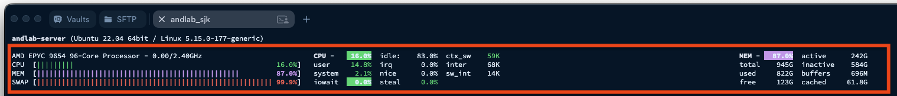

안녕하세요.
이번 공용서버 재부팅 및 Milvus 서비스 중단과 관련하여 상황 공유와 함께, 앞으로의 서버 리소스 사용에 대한 협조를 요청드리고자 메일드립니다.

먼저 지난 토요일(5/31)에 있었던 상황을 간단히 공유드립니다. 랩실에서 사용 중인 Milvus 서버를 다시 가동하려고 했으나, 기동 중간에 끊기는 현상이 반복적으로 발생했습니다. 이에 건일님의 도움으로 서버 상태를 확인한 결과 이번 문제는 Docker 자체의 문제나 GPU VRAM 부족 문제가 아니라, 시스템 RAM 부족으로 인한 OOM(Out of Memory) 상황이 원인으로 확인되었습니다.

구체적으로는, 현재 Milvus에 올라가 있는 collection 수가 이전보다 증가하면서 Milvus가 정상적으로 가동되고 기존 collection들을 로드하기 위해 필요한 RAM 용량도 함께 증가한 상황입니다. 현재 Milvus 가동 및 collection 로드에 대략 200GB 정도의 RAM이 필요한 것으로 보이는데, 이미 다른 사용자들의 실험/작업이 상당한 RAM을 점유하고 있어 서버 전체 메모리 사용량이 거의 한계에 도달한 상태였습니다.

실제로 확인 당시 서버의 메모리 사용률은 거의 포화 상태였고, glances 등을 통해 확인했을 때 거의 100% 수준까지 올라간 상태였습니다. 이로 인해 Milvus가 collection을 모두 로드하지 못하고 safe close로 종료되었으며, 단순히 Milvus만의 문제가 아니라 SSH 접속 지연, 일반 명령 실행 지연 등 서버 전체 사용성에도 영향을 줄 수 있는 상황이었습니다. 다행히 동국님과 요한님이 직접 학교에 방문해 서버를 재부팅해주셨고, 현재는 서버 접속 및 기본적인 사용이 원활히 이루어지고 있는 상태입니다.

이번 건은 서버 자체 고장이나 Docker/GPU VRAM 문제가 아니라, 공용서버의 RAM이 여러 작업에 의해 거의 모두 사용되면서 발생한 리소스 부족 문제로 이해해주시면 될 것 같습니다.

공용서버는 모두가 함께 사용하는 자원이므로, 앞으로는 각자 본인이 수행하는 작업이 CPU, RAM, GPU VRAM 등 서버 리소스를 얼마나 사용하고 있는지 주기적으로 확인해 주시면 감사하겠습니다. 특히 대용량 데이터 로딩, 모델 학습/추론, 벡터 DB collection 로드, 멀티프로세싱 작업 등은 예상보다 많은 RAM을 점유할 수 있으므로, 작업 실행 전후로 리소스 사용량을 확인해주시기 바랍니다.

리소스 사용량은 예를 들어 아래 명령어들로 확인할 수 있습니다.

`htop`
`top`
`free -h`
`glances`
`nvidia-smi`
특히 GPU 작업이라고 생각하고 실행한 코드도 실제로는 GPU VRAM을 충분히 사용하지 않고 CPU/RAM 위주로 동작할 수 있습니다. 따라서 GPU 사용량뿐만 아니라 시스템 RAM 사용량도 함께 확인해주시면 좋겠습니다.

또한 특정 작업이 장시간 많은 메모리를 점유하거나, 서버 전체 사용량이 높은 상황에서는 다른 사용자들의 작업에도 영향을 줄 수 있습니다. 대규모 작업을 실행해야 하는 경우에는 가능하면 사전에 공유해주시고, 작업이 끝난 뒤에는 불필요하게 남아 있는 프로세스나 세션이 없는지도 확인해주시면 감사하겠습니다.

추가로, 현재 공용서버1에 작업이 집중되는 경향이 있습니다. 랩에는 공용서버2도 함께 운영되고 있으므로, 공용서버1의 리소스가 부족하거나 작업이 몰리는 경우에는 공용서버2에 각자 계정을 생성하여 작업을 분산해주셔도 됩니다. 서버 간 작업 분산을 통해 한 서버에 부하가 집중되는 상황을 줄일 수 있을 것으로 생각됩니다.

마지막으로, 이전에 민경님이 공유해주신 것처럼 `/home` 용량 관리와 CPU 최대 가용 thread 수 제한 설정을 각자 계정별로 꼭 적용해주시면 감사하겠습니다. 관련 명령어와 설정 방법은 이미 공유되어 있으며, 조금만 시간을 투자하면 간단히 끝낼 수 있는 내용입니다. 한 번 설정해두면 이후에는 계속 적용되므로, 공용서버를 안정적으로 사용하기 위해 꼭 확인 부탁드립니다.

특히 가상환경, 캐시, 데이터셋, 모델 체크포인트, 실험 로그 등 대용량 파일은 `/home`이 아니라 `/mnt/nvme03/계정명/` 등 별도 저장공간에 저장해주시기 바랍니다. 예를 들어 conda 가상환경은 아래와 같이 /mnt 하위에 생성할 수 있습니다.

`conda create -p /mnt/nvme03/계정명/envs/myenv python=3.10`
`conda activate /mnt/nvme03/계정명/envs/myenv`
HuggingFace, PyTorch, pip 캐시도 기본값인 `~/.cache`가 아니라 `/mnt` 하위로 이동하도록 아래 내용을 `~/.bashrc`에 추가해주시기 바랍니다.

`export HF_HOME=/mnt/nvme03/계정명/.cache/huggingface`
`export TORCH_HOME=/mnt/nvme03/계정명/.cache/torch`
`export PIP_CACHE_DIR=/mnt/nvme03/계정명/.cache/pip`
또한 PyTorch/HuggingFace 등을 실행할 때 별도 설정이 없으면 서버의 CPU thread를 과도하게 점유할 수 있습니다. 불필요한 thread 경합을 줄이고 서버 전체 안정성을 높이기 위해 아래 설정도 각자 `~/.bashrc`에 추가해주시기 바랍니다.

`echo 'export TOKENIZERS_PARALLELISM=false' >> ~/.bashrc`
`echo 'export OMP_NUM_THREADS=8' >> ~/.bashrc`
`echo 'export MKL_NUM_THREADS=8' >> ~/.bashrc`
`source ~/.bashrc`
위 설정은 개인 실험 속도에도 오히려 도움이 되는 경우가 많으니, 아직 적용하지 않으신 분들은 꼭 확인 부탁드립니다.

이번 일을 계기로, 공용자원을 사용하는 만큼 본인의 작업이 서버 전체에 미치는 영향을 한 번 더 확인하고, 서로의 작업에 영향을 주지 않도록 조금 더 신경 써주시면 감사하겠습니다. 서버 사용 중 리소스 부족, 접속 지연, 서비스 이상 등이 보이면 빠르게 공유해주시기 바랍니다.

협조해주셔서 감사합니다.

