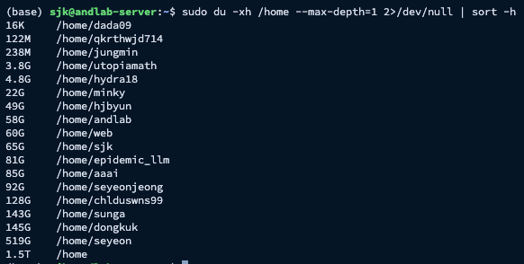
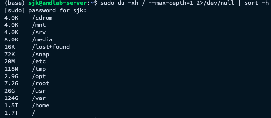

랩실 여러분께,

현재 공용 서버의 루트 파티션(/) 사용률이 거의 100%에 도달한 상태입니다.
OS가 설치되어 있는 핵심 영역의 전체 용량 약 1.8TB 중 대부분이 사용되어 남은 공간이 거의 없는 상황이고,
특히 `/home` 디렉토리에서만 약 1.5TB를 사용 중이며, 이로 인해 시스템 운영에 필요한 여유 공간이 사실상 소진된 상태입니다.

루트 파티션이 100%에 도달하면 다음과 같은 문제가 발생할 수 있습니다.
- 로그 기록 불가 → 장애 발생 시 원인 분석 불가
- 패키지 설치/업데이트 실패
- Python 가상환경 생성 실패
- 모델 학습 중 체크포인트 저장 실패
- 임시파일 생성 실패로 인한 코드 실행 오류
- 서비스/프로세스 비정상 종료
- 최악의 경우 시스템 부팅 실패

즉, 지금 상태가 지속되면 연구 작업이 중단되거나 서버 자체가 불안정해질 수 있습니다.
이에 모든 사용자 분들은 본인 계정(/home/계정명) 내의 아래 항목들을 확인하여 금주 금요일(2/6)까지 불필요한 데이터는 과감히 삭제하거나 정리해 주시길 부탁드립니다.

1. 사용하지 않는 가상환경 삭제
테스트용으로 만들고 방치한 conda/venv 환경 삭제
conda clean --all 명령어로 캐시 정리

2. 오래된 모델 체크포인트 및 로그 정리
학습이 끝난 이전 epoch의 .pt, .ckpt 파일 삭제 → best 만 남겨두기
불필요하게 쌓인 Tensorboard 로그 및 텍스트 로그 삭제

3. 대용량 데이터셋 및 결과물 이동
홈 디렉토리(/home)는 운영체제 전용 공간입니다.
모든 대용량 데이터와 결과물은 반드시 압축하여 용량이 넉넉한 /mnt/nvme03 영역 또는 개인 클라우드 저장소로 이동시켜 주시기 바랍니다.
/home/*/.cache 영역에 저장된 캐시 파일들을 지워도 충분한 용량 확보가 가능합니다.

현재 목표는 시스템의 안정적인 운용과 로그 기록, 패키지 업데이트 등을 위해 최소 300GB~400GB(전체 용량의 약 20%) 이상의 여유 공간을 확보해야 합니다.
원활한 연구 환경 유지를 위해 모든 분들의 적극적인 협조를 부탁드립니다.

감사합니다.

---

저는 이렇게 이미 nvme02에 저장하고 있는데 다음을 참고해주셔도 좋을것같아요~
[서버 /home 용량 관련 설정 안내]
────────────────────────
가상환경을 /mnt에 생성
■ conda
conda create -p /mnt/nvme03/계정명/envs/myenv python=3.10
conda activate /mnt/nvme03/계정명/envs/myenv 
────────────────────────
캐시 저장 위치를 /mnt로 변경 (권장)
기본적으로 캐시는 ~/.cache (/home)에 저장됩니다.
아래 환경 변수를 설정하면 /mnt로 저장됩니다.
export HF_HOME=/mnt/nvme03/계정명/.cache/huggingface
export TORCH_HOME=/mnt/nvme03/계정명/.cache/torch
export PIP_CACHE_DIR=/mnt/nvme03/계정명/.cache/pip
지속 적용을 위해 위 내용을 ~/.bashrc 에 추가해주세요.
────────────────────────
데이터 및 결과물 저장 위치
다음 항목은 모두 /mnt/nvme03/계정명/ 하위에 저장 부탁드립니다.
Dataset
모델 체크포인트 (.pt, .ckpt 등)
실험 로그 (Tensorboard, WandB 등)
기타 대용량 결과 파일

추가로 좋은 방법이 있으면 함께 공유해주세요.
감사합니다.