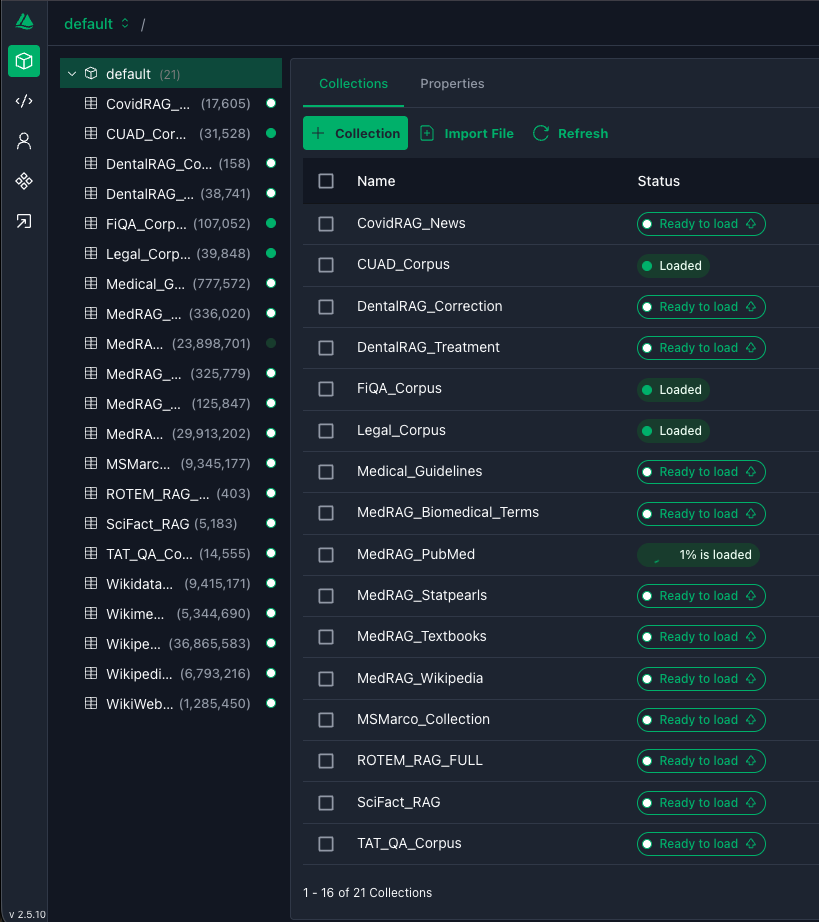
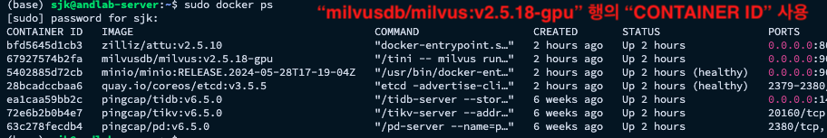

## 2026.06.15

- 공용서버1 이슈 정리
  - 주문한 16개의 RAM들이 서버에 설치되어 있었음에도 불구하고 실제로는 1개가 인식되지 않고 있었음
  - 실제 RAM 1개가 불량이라는 걸 확인하고 나서 xdnode 측에서 무상으로 보상함
	  - 엔지니어 분이 오셔서 직접 체크하심
  - 교체하고 나서는 정상적으로 인식되고 있음
  - CLI 명령어를 확인하면 서버 내 어느 슬롯에 RAM이 연결되어 있는지 확인할 수 있음
	  - `sudo dmidecode -t memory | egrep "Locator:|Bank Locator:|Size:"`
		  - `Size: No Module Installed`: 미설치 or 인식 x
		  - `Size: 64 GB`: 정상 설치
  - 나중에 RAM이 아닌 RAM 슬롯에 문제가 발생한다면 메인보드 교체가 필요함
	  - 보통 서버 메인보드 A/S 보증기간이 3년인데 현재 공용서버1은 2년을 넘긴 상황임
	  - 관련 문제가 발생한다면 최대한 빠르게 바꿔야 함
  - 현재 인식되는 메모리들이 뭐가 있는지 확인하기 위한 쉘 스크립트(ram_info.sh)를 공용서버1,2에 구현함
	  - 가이드에 포함시킬 것

## 2026.05.24

- 공용서버 RAM 교체 작업
  - 서버1 에 있던 RAM 16개를 서버2로 모두 이동
  - 기존 서버2에 있던 RAM 4개까지 합쳐서 서버2에는 총 20개의 RAM이 설치됨
  - 새로 주문한 RAM (SK 하이닉스 제조) 15개 중 12개를 서버1에 장착
    - 이후 배송될 1개까지 합쳐서 나머지 RAM 4개까지 추가로 장착할 예정
  - GPU VRAM에 비례해서 RAM 용량도 늘어나야 함
    - 서버2에 GPU 1대 더 들어와서 총 4대가 설치될 예정
  - 서류 작업 시 배정된 예산 안에서 구매한 부품들끼리 사진을 찍어야 함
    - 아무리 제조사가 달라도 예외가 없음
  - 구매 직후, 설치 후, 정상작동 여부 확인이 필요함

---

- 신규 서버 관련 
	- 디스크 1T, 16T 2개로 구성
	- 16T 디스크에 운영체제 설치할 예정
	- OS는 24.04 LTS로 설치할 예정
- 자주 쓸 명령어
	- 계정별 home 디렉토리 경로 확인
		- `awk -F: '$3 >= 1000 && $3 < 65534 {printf "%-20s %s\n", $1 ":", $6}' /etc/passwd`
	- /home 내 계정별 용량 확인
		- `sudo du -sh /home/* | sort -h`
	- shutdown 관련
		- shutdown 예약
			- `sudo shutdown -h {UTC 기준 시간}`
		- shutdown 스케줄 확인
			- `cat /run/systemd/shutdown/scheduled`
	- 👉 서버 종료/구동하는데 실행할 명령어들을  개별 스크립트로 정리하여 공유할 필요가 있음
- 개인 쉘
	- 계정별로 가진 권한 확인
		- `check_accounts_permissions.sh`
	- 현재 호스트의 시스템 정보 수집 + `sysinfo_{host 이름}_{실행날짜}.txt` 파일로 정리 
		- `collect_sysinfo.sh`
	- 사용자 계정 추가 이후 권한 할당을 위한 파일로 접속
		- `sudo visudo`
- milvus 서버 관련
	- milvus attu 접속 링크
		- http://165.132.192.52:8000/#/connect
	- milvus 관련 컨테이너 상태 확인
		- `sudo docker ps -a | grep milvus `
	- 컨테이너 시작/종료
		- `sudo docker compose -f /mnt/nvme02/home/lurker18/Documents/Milvus/docker-compose.yml up -d`
		- `sudo docker compose -f /mnt/nvme02/home/lurker18/Documents/Milvus/docker-compose.yml down`
	- 사용할 벡터db는 attu 페이지 > "Status" 컬럼에서 on/off 가능
		
	- Milvus container id 복사 (참고링크)
		- `docker cp milvus.yaml <milvus_container_id>:/milvus/configs/milvus.yaml`
		
- 계정생성 시 추가할 설정 (.bashrc)
	- # Cache PATH
	- `export HF_HOME=/mnt/nvme03/home/{계정명}/.cache/huggingface`
	- `export TORCH_HOME=/mnt/nvme03/home/{계정명}/.cache/torch`
	- `export PIP_CACHE_DIR=/mnt/nvme03/home/{계정명}/.cache/pip`
	- # NUM_THREADS
	- `export TOKENIZERS_PARALLELISM=false`
	- `export OMP_NUM_THREADS=8`
	- `export MKL_NUM_THREADS=8`

